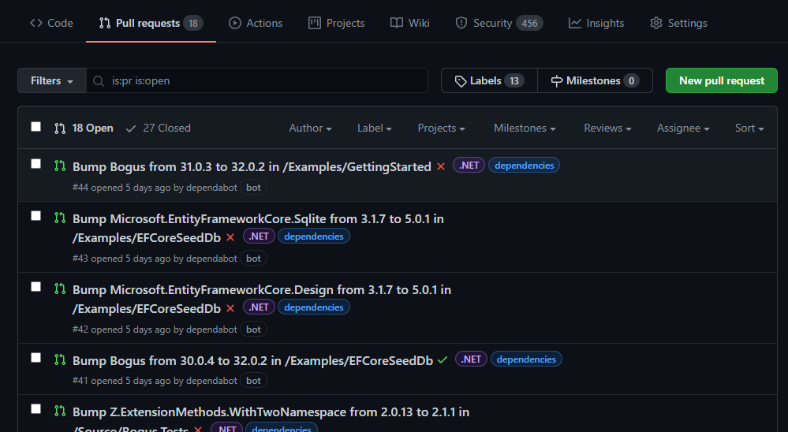
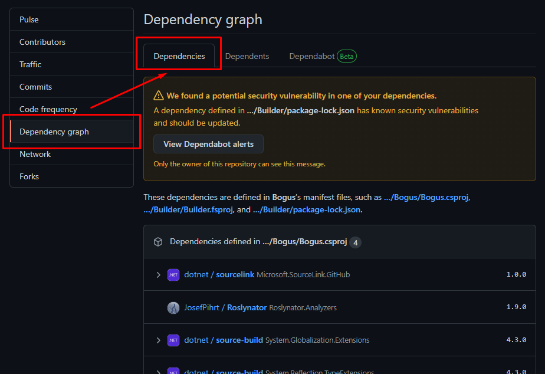
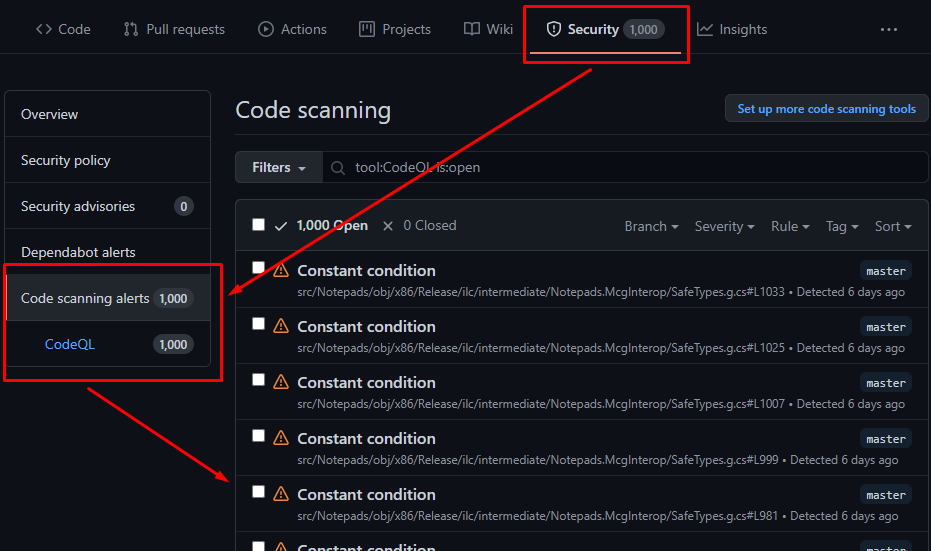

# RestSharp CI/CD documentation

## 1. Set up Dependabot

Dependabot is a GitHub native security tool that goes through the dependencies in the project and creates alerts, and PRs with updates when a new and/or non-vulnerable version is found.

- for PRs with version updates, this pipeline comes pre-configured for all current dependency sources in the project, so at "Insights" tab -> "Dependency graph" -> "Dependabot", you should be able to see all tracked sources of dependencies, when they have been checked last and view a full log of the last check

### Set up security alerts and updates
##### - GitHub, through Dependabot, also natively offers a security check for vulnerable dependencies

1. Go to the project's GitHub repository and click on the **Settings** tab

2. Go to **Security & analysis** section

3. Click "Enable" for both "Dependabot alerts" and "Dependabot security updates"

- By enabling "Dependabot alerts", you would be notified for any vulnerable dependencies in the project. At "Security" tab -> "Dependabot alerts", you can manage all alerts. By clicking on an alert, you would be able to see a detailed explanation of the vulnerability and a viable solution.

- By enabling "Dependabot security updates", you authorize Dependabot to create PRs specifically for **security updates**

### Set up Dependency graph
##### - The "Dependency graph" option should be enabled by default for all public repos, but in case it isn't:

1. Go to the project's GitHub repository and click on the **Settings** tab

2. Go to **Security & analysis** section

3. Click "Enable" for the "Dependency graph" option

- this option enables the "Insights" tab -> "Dependency graph" section -> "Dependencies" tab, in which all the dependencies for the project are listed, under the different manifests they are included in

NOTE: **screenshots are only exemplary**

 

## 2. CodeQL

CodeQL is GitHub's own industry-leading semantic code analysis engine. CodeQL requires no setup, because it comes fully pre-configured by us. 

To activate it and see its results, only a push commit or a merge of a PR to the default branch of your repository, is required. 

We've also configured CodeQL to run on schedule, so every day at 8:00AM UTC, it automatically tests the code.

- you can see the results here at **Security** tab -> **Code scanning alerts** -> **CodeQL**:

- on the page of each result, you can see an explanation of what the problem is and also one or more solutions:

#

Built with ❤ by [Pipeline Foundation](https://pipeline.foundation)
